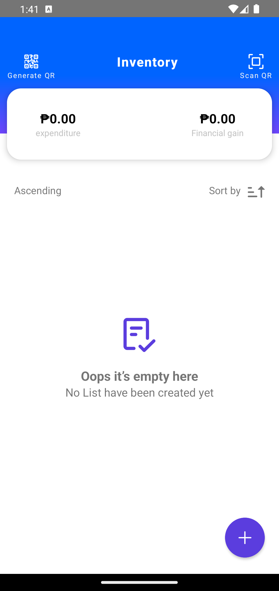

# Inventory Management

React Native Application for Managing Sales Inventory

This application highlights the used of SQLite Storage and Scanning and Generating QR code.

## Highlighted Resources

- @haskkor/react-native-pincode
- react-native-swipe-list-view
- react-native-sqlite-storage
- redux
- formik

## Contributing

- Raise an issue in for a task to do
- Describe what will be the update and what file will be changes
- create a PR to the main/master branch if done

## Build

To build APK or AAB or IPA, please follow [https://medium.com/geekculture/react-native-generate-apk-debug-and-release-apk-4e9981a2ea51]

To start Metro, run the following command from the _root_ of your React Native project:

```bash
# using npm
npm start

# OR using Yarn
yarn start
```

### For Android

```bash
# using npm
npm run android

# OR using Yarn
yarn android
```

### For iOS

```bash
# using npm
npm run ios

# OR using Yarn
yarn ios
```

<div align="center">
  
</div>
